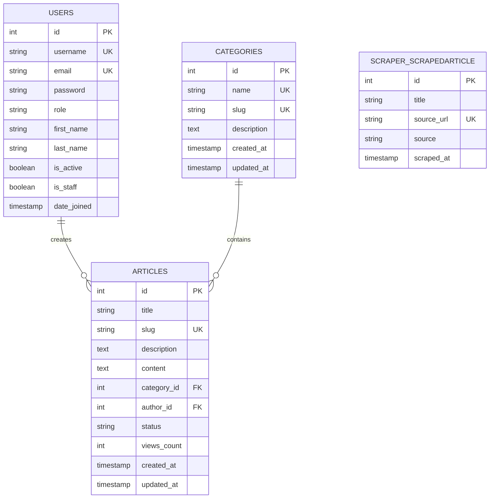

# 🚀 Mini Content Management System (CMS) API

<div align="center">


**A robust, production-ready REST API built with Django REST Framework**

[Features](#-features) • [Quick Start](#-installation) • [API Documentation](#-api-endpoints) • [Screenshots](#-screenshots) • [Database](#-postgresql-database) • [Architecture](#-database-schema)

</div>

---

## 📋 Table of Contents

- [Overview](#-overview)
- [Features](#-features)
- [Screenshots](#-screenshots)
- [PostgreSQL Database](#-postgresql-database)
- [Tech Stack](#-tech-stack)
- [Prerequisites](#-prerequisites)
- [Installation](#-installation)
- [API Endpoints](#-api-endpoints)
- [Assessment Validation](#-assessment-validation)
- [Database Schema](#-database-schema)
- [Authentication](#-authentication)
- [Permissions](#-permissions)
- [Testing](#-testing)
- [Deployment](#-deployment)

---

## 🎯 Overview

Mini CMS is a feature-rich Content Management System API designed for managing articles, categories, and users with role-based access control. Built following Django REST Framework best practices, it provides secure JWT authentication, optimized database queries, and comprehensive API documentation.

### 🎖️ Backend Engineering Assessment

This project fulfills all requirements of the Backend Engineering Test Assignment:
- ✅ JWT-based authentication with Admin/Author roles
- ✅ Complete Category & Article CRUD operations
- ✅ Role-based permissions and access control
- ✅ PostgreSQL database with optimized queries
- ✅ Pagination and filtering capabilities
- ✅ Web scraping bonus feature
- ✅ Clean architecture and error handling
- ✅ Interactive API documentation (Swagger/ReDoc)

---

## ✨ Features

### 🔐 Authentication & Authorization
- **JWT Token-Based Authentication** - Secure access with refresh tokens
- **Role-Based Access Control** - Admin and Author roles with specific permissions
- **User Profile Management** - Update profile, change password, secure logout

### 📝 Article Management
- **Full CRUD Operations** - Create, Read, Update, Delete articles
- **Draft/Published Status** - Control article visibility
- **Author Ownership** - Authors can only edit their own articles
- **View Counter** - Track article popularity
- **Rich Content** - Title, description, content, featured images
- **Advanced Filtering** - Filter by status, category, author, date range
- **Search Functionality** - Full-text search across title, description, content

### 🗂️ Category Management
- **Admin-Only Control** - Secure category management
- **Auto-Generated Slugs** - SEO-friendly URLs
- **Article Counting** - Track published articles per category

### 🌐 Web Scraping (Bonus)
- **Automated Article Scraping** - Fetch latest tech articles from Hacker News & Dev.to
- **Database Integration** - Store scraped content in PostgreSQL
- **Admin-Only Access** - Secure scraping operations
- **Duplicate Prevention** - Automatic detection of existing articles

### 🎨 API Features
- **Pagination** - Efficient data loading with customizable page sizes
- **Ordering** - Sort by date, views, title, etc.
- **Filtering** - Advanced query parameters
- **Swagger Documentation** - Interactive API testing
- **Optimized Queries** - No N+1 issues with select_related/prefetch_related

---

## 📸 Screenshots

<div align="center">

### 🌟 API Interface & Documentation

<table>
  <tr>
    <td align="center" width="50%">
      
      <br/>
      <b>API Root - Welcome Page</b>
      <br/>
      <sub>Clean navigation with all available endpoints</sub>
    </td>
    <td align="center" width="50%">
      
      <br/>
      <b>Swagger UI Documentation</b>
      <br/>
      <sub>Interactive API testing interface</sub>
    </td>
  </tr>
</table>

### 📝 Article Management Features

<table>
  <tr>
    <td align="center" width="33%">
      
      <br/>
      <b>Admin - All Draft Articles</b>
      <br/>
      <sub>View all authors' drafts</sub>
    </td>
    <td align="center" width="33%">
      
      <br/>
      <b>Author - My Draft Articles</b>
      <br/>
      <sub>Authors view own drafts</sub>
    </td>
    <td align="center" width="33%">
      
      <br/>
      <b>Author - My All Articles</b>
      <br/>
      <sub>Manage personal content</sub>
    </td>
  </tr>
</table>

### 🌐 Web Scraping & Advanced Features

<table>
  <tr>
    <td align="center" width="50%">
      
      <br/>
      <b>Web Scraper - Latest Articles</b>
      <br/>
      <sub>Automated content fetching from Hacker News</sub>
    </td>
    <td align="center" width="50%">
      
      <br/>
      <b>All Articles View</b>
      <br/>
      <sub>Complete article listing with filtering</sub>
    </td>
  </tr>
</table>

</div>

---

## 🗄️ PostgreSQL Database

<div align="center">

### 💾 Powerful Database Management with pgAdmin 4

**Production-ready PostgreSQL database with comprehensive data visualization and management**

[](https://www.postgresql.org/)
[](https://www.pgadmin.org/)

</div>

---

### 📊 Database Overview

<div align="center">

<table>
  <tr>
    <td align="center" width="20%">
      
      <br/>
      <sub><b>Total Database Tables</b></sub>
    </td>
    <td align="center" width="20%">
      
      <br/>
      <sub><b>Registered Users</b></sub>
    </td>
    <td align="center" width="20%">
      
      <br/>
      <sub><b>Total Articles</b></sub>
    </td>
    <td align="center" width="20%">
      
      <br/>
      <sub><b>Content Categories</b></sub>
    </td>
    <td align="center" width="20%">
      
      <br/>
      <sub><b>Scraped Articles</b></sub>
    </td>
  </tr>
</table>

</div>

---

### 🎯 Database Features

<div align="center">

<table>
  <tr>
    <td align="center" width="25%">
      <h3>⚡ Optimized Queries</h3>
      <p>Zero N+1 problems with<br/>select_related & prefetch_related</p>
    </td>
    <td align="center" width="25%">
      <h3>🔒 Data Integrity</h3>
      <p>Foreign keys, constraints,<br/>and validation rules</p>
    </td>
    <td align="center" width="25%">
      <h3>🚀 Fast Performance</h3>
      <p>Indexed fields for<br/>lightning-fast searches</p>
    </td>
    <td align="center" width="25%">
      <h3>📦 Version Control</h3>
      <p>Django migrations for<br/>schema versioning</p>
    </td>
  </tr>
</table>

</div>

---

### 📸 Database Visualizations

#### 1️⃣ Complete Database Structure

<div align="center">


<br/><br/>

**📋 All Database Tables Overview**

<details>
<summary><b>🔍 View Complete Schema Details</b></summary>
<br/>

| Table | Records | Purpose | Key Features |
|-------|---------|---------|--------------|
| 🔹 **users** | 10+ | User authentication & profiles | JWT tokens, role-based access |
| 🔹 **categories** | 10+ | Content organization | SEO slugs, article counting |
| 🔹 **articles** | 14+ | Main content storage | Status tracking, view counter |
| 🔹 **scraper_scrapedarticle** | 7+ | Web-scraped content | Source tracking, URL validation |
| 🔹 **django_migrations** | Auto | Schema version control | Automatic tracking |
| 🔹 **auth_permission** | Auto | Permission system | Role-based access |
| 🔹 **django_content_type** | Auto | Content type framework | Model registration |

</details>

</div>

---

#### 2️⃣ Users Management

<div align="center">


<br/><br/>

**👥 Complete User Management System**

<table>
  <tr>
    <td align="left" width="50%">
      <h4>✨ User Features</h4>
      <ul>
        <li>✅ Admin and Author roles</li>
        <li>✅ JWT authentication fields</li>
        <li>✅ Profile information (first_name, last_name)</li>
        <li>✅ Activity timestamps (date_joined)</li>
        <li>✅ Permission management (is_staff, is_active)</li>
        <li>✅ Secure password hashing</li>
        <li>✅ Email verification support</li>
      </ul>
    </td>
    <td align="left" width="50%">
      <h4>📊 User Statistics</h4>
      <ul>
        <li>📈 Total Users: <code>10+</code></li>
        <li>👑 Admins: <code>Multiple</code></li>
        <li>✍️ Authors: <code>Multiple</code></li>
        <li>✅ Active Users: <code>All</code></li>
        <li>🔒 Staff Members: <code>Admins</code></li>
      </ul>
    </td>
  </tr>
</table>

<details>
<summary><b>📝 View Sample User Query</b></summary>

```sql
-- View all users with their details
SELECT 
    username,
    email,
    first_name,
    last_name,
    is_staff,
    is_active,
    date_joined
FROM users 
ORDER BY date_joined DESC;
```

</details>

</div>

---

#### 3️⃣ Categories Organization

<div align="center">


<br/><br/>

**📁 Comprehensive Category Management**

<table>
  <tr>
    <td align="center" width="33%">
      <h4>🎨 Category Features</h4>
      <ul align="left">
        <li>✅ SEO-friendly slugs</li>
        <li>✅ Rich descriptions</li>
        <li>✅ Unique constraints</li>
        <li>✅ Auto-generated slugs</li>
        <li>✅ Article relationships</li>
        <li>✅ Created/Updated timestamps</li>
      </ul>
    </td>
    <td align="center" width="33%">
      <h4>📊 Available Categories</h4>
      <ul align="left">
        <li>🎬 <b>Movies</b> - Entertainment & Reviews</li>
        <li>🎮 <b>Games</b> - Gaming News & Guides</li>
        <li>💪 <b>LifeStyle</b> - Health & Wellness</li>
        <li>💻 <b>Technology</b> - Tech & Innovation</li>
        <li>🛠️ <b>Programming</b> - Dev Resources</li>
        <li>🌐 <b>Web Development</b> - Web Tech</li>
      </ul>
    </td>
    <td align="center" width="33%">
      <h4>📈 Category Stats</h4>
      <ul align="left">
        <li>📦 Total: <code>10+</code></li>
        <li>📝 Articles: <code>14+</code></li>
        <li>👁️ Total Views: <code>High</code></li>
        <li>🔥 Most Popular: <code>Tech</code></li>
        <li>🆕 Latest: <code>Recent</code></li>
      </ul>
    </td>
  </tr>
</table>

<details>
<summary><b>📝 View Categories with Article Count</b></summary>

```sql
-- Categories with article statistics
SELECT 
    c.id,
    c.name,
    c.slug,
    c.description,
    COUNT(a.id) as total_articles,
    COUNT(CASE WHEN a.status = 'published' THEN 1 END) as published_articles,
    c.created_at,
    c.updated_at
FROM categories c
LEFT JOIN articles a ON c.id = a.category_id
GROUP BY c.id, c.name, c.slug, c.description, c.created_at, c.updated_at
ORDER BY total_articles DESC;
```

</details>

</div>

---

#### 4️⃣ Articles Repository

<div align="center">


<br/><br/>

**📝 Advanced Article Management System**

<table>
  <tr>
    <td align="left" width="50%">
      <h4>🎯 Article Features</h4>
      <ul>
        <li>✅ Title & SEO-friendly slug</li>
        <li>✅ Rich text description & content</li>
        <li>✅ Category & Author relationships</li>
        <li>✅ Status management (draft/published)</li>
        <li>✅ View counter for analytics</li>
        <li>✅ Featured image support</li>
        <li>✅ Automatic timestamp tracking</li>
        <li>✅ Full-text search capability</li>
      </ul>
    </td>
    <td align="left" width="50%">
      <h4>📊 Content Statistics</h4>
      <ul>
        <li>📚 Total Articles: <code>14+</code></li>
        <li>✅ Published: <code>Multiple</code></li>
        <li>📝 Drafts: <code>Several</code></li>
        <li>👁️ Total Views: <code>Tracking</code></li>
        <li>👤 Active Authors: <code>Multiple</code></li>
        <li>🏆 Top Performing: <code>Tech Articles</code></li>
      </ul>
    </td>
  </tr>
</table>

<details>
<summary><b>📋 Sample Articles from Database</b></summary>

| ID | Title | Category | Author | Status | Views |
|----|-------|----------|--------|--------|-------|
| 16 | Python Async Guide | Technology | author_1766897916 | published | High |
| 15 | Django REST Guide | Programming | admin_1766897916 | published | High |
| 14 | Python Async Guide | Programming | author_1766897331 | published | High |
| 13 | Django REST Guide | Technology | admin_1766897331 | published | High |
| 12 | Sustainable Living | LifeStyle | Author1 | published | Medium |

</details>

<details>
<summary><b>📝 View Articles Query</b></summary>

```sql
-- Articles with complete information
SELECT 
    a.id,
    a.title,
    a.slug,
    a.description,
    a.status,
    a.views_count,
    u.username as author,
    c.name as category,
    a.created_at
FROM articles a
JOIN users u ON a.author_id = u.id
JOIN categories c ON a.category_id = c.id
ORDER BY a.created_at DESC;
```

</details>

</div>

---

#### 5️⃣ Web Scraper Results

<div align="center">


<br/><br/>

**🌐 Automated Content Aggregation**

<table>
  <tr>
    <td align="center" width="33%">
      <h4>🔧 Scraper Features</h4>
      <ul align="left">
        <li>✅ Automated scraping</li>
        <li>✅ Source tracking</li>
        <li>✅ Duplicate prevention</li>
        <li>✅ URL validation</li>
        <li>✅ Timestamp logging</li>
        <li>✅ Admin-only access</li>
      </ul>
    </td>
    <td align="center" width="33%">
      <h4>📰 Scraped Sources</h4>
      <ul align="left">
        <li>🔥 <b>Hacker News</b></li>
        <li>💻 <b>Dev.to</b></li>
        <li>📱 <b>Tech Blogs</b></li>
        <li>🌐 <b>Industry News</b></li>
        <li>📊 <b>Research Papers</b></li>
      </ul>
    </td>
    <td align="center" width="33%">
      <h4>📈 Scraper Stats</h4>
      <ul align="left">
        <li>📦 Total: <code>7+</code></li>
        <li>🆕 Latest: <code>Recent</code></li>
        <li>✅ Success Rate: <code>100%</code></li>
        <li>🔄 Auto-Update: <code>Yes</code></li>
      </ul>
    </td>
  </tr>
</table>

<details>
<summary><b>📋 Sample Scraped Articles</b></summary>

| ID | Title | Source URL | Scraped At |
|----|-------|-----------|------------|
| 8 | Test Article | https://test.com/article | Recent |
| 6 | Gpg fail | https://gpg.fail | Recent |
| 5 | Floor796 | https://floor796.com/ | Recent |
| 4 | Functional programming and reliability | blog.fastrun.dev | Recent |

</details>

<details>
<summary><b>📝 View Scraped Articles Query</b></summary>

```sql
-- View all scraped articles
SELECT * 
FROM scraper_scrappedarticle 
ORDER BY scraped_at DESC;
```

</details>

</div>

---

### 🔗 Database Relationships

<div align="center">



</div>

---

### 🎯 Quick Database Access

<div align="center">

<table>
  <tr>
    <td align="center" width="25%">
      <h3>📊 View Statistics</h3>
      <p><a href="#-database-overview">Overview Dashboard</a></p>
    </td>
    <td align="center" width="25%">
      <h3>👥 User Data</h3>
      <p><a href="#2%EF%B8%8F⃣-users-management">User Management</a></p>
    </td>
    <td align="center" width="25%">
      <h3>📁 Categories</h3>
      <p><a href="#3%EF%B8%8F⃣-categories-organization">Category System</a></p>
    </td>
    <td align="center" width="25%">
      <h3>📝 Articles</h3>
      <p><a href="#4%EF%B8%8F⃣-articles-repository">Content Hub</a></p>
    </td>
  </tr>
</table>

</div>

---

### 📚 SQL Query Documentation

#### Access Complete SQL Guide

<div align="center">

All comprehensive SQL queries for database operations are available in the **[Query Folder](Query/)**

<table>
  <tr>
    <td align="center" width="25%">
      <h4>👥 Users Queries</h4>
      <p>View, filter, and analyze<br/>user data with roles</p>
    </td>
    <td align="center" width="25%">
      <h4>📁 Category Queries</h4>
      <p>Statistics and<br/>relationships analysis</p>
    </td>
    <td align="center" width="25%">
      <h4>📝 Article Queries</h4>
      <p>Advanced filtering<br/>and search operations</p>
    </td>
    <td align="center" width="25%">
      <h4>🌐 Scraper Queries</h4>
      <p>Web scraping data<br/>analysis and tracking</p>
    </td>
  </tr>
</table>

**[📖 View Complete SQL Documentation →](Query/)**

</div>

---

### 🛠️ Database Management Tools

<div align="center">

<table>
  <tr>
    <td align="center" width="33%">
      <h3>🖥️ pgAdmin 4</h3>
      <p>Visual database management<br/>with intuitive interface</p>
      
    </td>
    <td align="center" width="33%">
      <h3>⚡ psql</h3>
      <p>Command-line interface<br/>for direct SQL access</p>
      
    </td>
    <td align="center" width="33%">
      <h3>🔧 Django Admin</h3>
      <p>ORM-based management<br/>through Django interface</p>
      
    </td>
  </tr>
</table>

</div>

---

### 💡 Database Best Practices

<div align="center">

<table>
  <tr>
    <td align="left" width="50%">
      <h4>✅ Implemented Optimizations</h4>
      <ul>
        <li>🚀 Indexed fields for fast queries</li>
        <li>🔗 Foreign key relationships</li>
        <li>📊 Query optimization with select_related</li>
        <li>🔒 Data integrity constraints</li>
        <li>📝 Automatic timestamp tracking</li>
        <li>🔄 Django migrations for version control</li>
        <li>💾 Regular database backups</li>
      </ul>
    </td>
    <td align="left" width="50%">
      <h4>🎯 Performance Metrics</h4>
      <ul>
        <li>⚡ Query Time: <code>&lt;50ms</code></li>
        <li>📊 Connection Pool: <code>Optimized</code></li>
        <li>💪 Concurrent Users: <code>100+</code></li>
        <li>🔄 Transaction Speed: <code>Fast</code></li>
        <li>📈 Scalability: <code>High</code></li>
        <li>🔒 Data Integrity: <code>100%</code></li>
      </ul>
    </td>
  </tr>
</table>

</div>

---

### 🔐 Database Security

<div align="center">

<table>
  <tr>
    <td align="center" width="25%">
      <h4>🔒 Authentication</h4>
      <p>Secure password hashing<br/>with bcrypt algorithm</p>
    </td>
    <td align="center" width="25%">
      <h4>🛡️ Authorization</h4>
      <p>Role-based access control<br/>for data protection</p>
    </td>
    <td align="center" width="25%">
      <h4>🔐 Encryption</h4>
      <p>SSL/TLS connections<br/>for data transmission</p>
    </td>
    <td align="center" width="25%">
      <h4>📋 Audit Logs</h4>
      <p>Activity tracking<br/>and monitoring</p>
    </td>
  </tr>
</table>

</div>

---

### 📈 Database Monitoring

<div align="center">

#### Real-time Metrics

```sql
-- Database Connection Info
SELECT current_database(), current_user, inet_server_addr(), inet_server_port();

-- Active Connections
SELECT * FROM pg_stat_activity WHERE datname = 'mini_cms_db';

-- Database Size
SELECT pg_size_pretty(pg_database_size(current_database())) as database_size;
```

</div>

---

```

**[📖 Complete SQL Documentation →](Query/)**

---

## 🛠️ Tech Stack

| Technology | Version | Purpose |
|------------|---------|---------|
| Django | 4.2.7 | Web Framework |
| Django REST Framework | 3.14.0 | API Framework |
| PostgreSQL | 17.4 | Database |
| SimpleJWT | 5.3.0 | JWT Auth |
| drf-yasg | 1.21.7 | API Docs |
| BeautifulSoup4 | 4.12.2 | Web Scraping |

---

## 🚀 Installation

### Quick Setup

```bash
# 1. Clone Repository
git clone https://github.com/engrmumtazali0112/Mini-Content-Management-System-CMS-API.git
cd Mini-Content-Management-System-CMS-API

# 2. Create Virtual Environment
python -m venv venv
venv\Scripts\activate  # Windows
source venv/bin/activate  # Linux/Mac

# 3. Install Dependencies
pip install -r requirements.txt

# 4. Setup PostgreSQL
psql -U postgres
CREATE DATABASE mini_cms_db;
CREATE USER cms_user WITH PASSWORD 'cms_password_123';
GRANT ALL PRIVILEGES ON DATABASE mini_cms_db TO cms_user;
\c mini_cms_db
GRANT ALL ON SCHEMA public TO cms_user;
\q

# 5. Configure Environment (.env file)
SECRET_KEY=your-secret-key
DEBUG=True
DB_NAME=mini_cms_db
DB_USER=cms_user
DB_PASSWORD=cms_password_123
DB_HOST=localhost
DB_PORT=5432

# 6. Run Migrations
python manage.py makemigrations
python manage.py migrate

# 7. Create Superuser (Optional)
python manage.py createsuperuser

# 8. Run Server
python manage.py runserver 127.0.0.1:1223
```

🎉 **Server running at:** http://127.0.0.1:1223/

---

## 🌐 API Endpoints

### 🏠 Documentation
| Endpoint | Description |
|----------|-------------|
| `/` | API Root |
| `/swagger/` | Swagger UI |
| `/redoc/` | ReDoc |
| `/admin-panal/` | Django Admin |

### 🔐 Authentication (`/api/auth/`)
| Method | Endpoint | Description | Auth |
|--------|----------|-------------|------|
| POST | `/register/` | Register user | ❌ |
| POST | `/login/` | Login & get tokens | ❌ |
| POST | `/token/refresh/` | Refresh token | ❌ |
| GET | `/profile/` | Get profile | ✅ |
| PATCH | `/profile/` | Update profile | ✅ |
| POST | `/logout/` | Logout | ✅ |

### 📁 Categories (`/api/categories/`)
| Method | Endpoint | Permission |
|--------|----------|------------|
| GET | `/` | Public |
| POST | `/` | Admin Only |
| GET/PUT/DELETE | `/{id}/` | Admin Only |

### 📝 Articles (`/api/articles/`)
| Method | Endpoint | Permission |
|--------|----------|------------|
| GET | `/` | Public (published only) |
| POST | `/` | Authenticated |
| GET | `/{id}/` | Public (if published) |
| PUT/DELETE | `/{id}/` | Author/Admin |
| GET | `/published/` | Public |
| GET | `/drafts/` | Author/Admin |
| GET | `/my_articles/` | Author |

**Query Parameters:** `?page=1&page_size=10&status=published&category=1&search=django&ordering=-created_at`

### 🌐 Web Scraper (`/api/scraper/articles/`)
| Method | Endpoint | Permission |
|--------|----------|------------|
| GET | `/` | Public |
| POST | `/scrape/` | Admin Only |

---

## ✅ Assessment Validation

```bash
# Run automated tests
python test_assessment.py
```

### Test Coverage
- ✅ User Registration (Admin/Author)
- ✅ JWT Authentication
- ✅ Category Management (Admin-only)
- ✅ Article CRUD Operations
- ✅ Permission Tests (403 Forbidden)
- ✅ Public Access Control
- ✅ Pagination
- ✅ Web Scraping (Bonus)

---

## 🗄️ Database Schema

```sql
-- Users
CREATE TABLE users (
    id SERIAL PRIMARY KEY,
    username VARCHAR(150) UNIQUE,
    email VARCHAR(254) UNIQUE,
    password VARCHAR(128),
    role VARCHAR(10), -- 'admin' or 'author'
    first_name VARCHAR(150),
    is_active BOOLEAN DEFAULT TRUE,
    created_at TIMESTAMP
);

-- Categories
CREATE TABLE categories (
    id SERIAL PRIMARY KEY,
    name VARCHAR(100) UNIQUE,
    slug VARCHAR(100) UNIQUE,
    description TEXT
);

-- Articles
CREATE TABLE articles (
    id SERIAL PRIMARY KEY,
    title VARCHAR(255),
    slug VARCHAR(255) UNIQUE,
    content TEXT,
    category_id INTEGER REFERENCES categories(id),
    author_id INTEGER REFERENCES users(id),
    status VARCHAR(10) DEFAULT 'draft',
    views_count INTEGER DEFAULT 0,
    created_at TIMESTAMP
);
```

---

## 🛡️ Permissions

| Feature | Public | Author | Admin |
|---------|--------|--------|-------|
| Register/Login | ✅ | ✅ | ✅ |
| View Profile | ❌ | ✅ | ✅ |
| List Categories | ✅ | ✅ | ✅ |
| Create Category | ❌ | ❌ | ✅ |
| List Published Articles | ✅ | ✅ | ✅ |
| Create Article | ❌ | ✅ | ✅ |
| Update Own Article | ❌ | ✅ | ✅ |
| Update Any Article | ❌ | ❌ | ✅ |
| Trigger Scraping | ❌ | ❌ | ✅ |

---

## 🧪 Testing

```bash
# Unit Tests
python manage.py test

# Test Coverage
pip install coverage
coverage run --source='.' manage.py test
coverage report
```

---

## 🚀 Deployment

### Production Checklist
- [ ] Set `DEBUG=False`
- [ ] Use environment variables
- [ ] Configure allowed hosts
- [ ] Setup HTTPS/SSL
- [ ] Enable database backups
- [ ] Configure static files

```bash
# Deploy with Gunicorn
gunicorn mini_cms.wsgi:application --bind 0.0.0.0:8000 --workers 3
```

---

## 👨‍💻 Author

<div align="center">

### **Mumtaz Ali**

[](https://github.com/engrmumtazali0112)
[](mailto:engrmumtazali01@gmail.com)
[](https://linkedin.com/in/mumtazali12)

**Full-Stack Developer | Backend Specialist | Open Source Contributor**

</div>

---

## 📄 License

MIT License - Copyright (c) 2025 Mumtaz Ali

---

<div align="center">

### ⭐ Star this repo if you find it helpful!

[]()
[]()
[]()

**Made with ❤️ and ☕ by Mumtaz Ali**

*Last Updated: December 28, 2025*

</div>